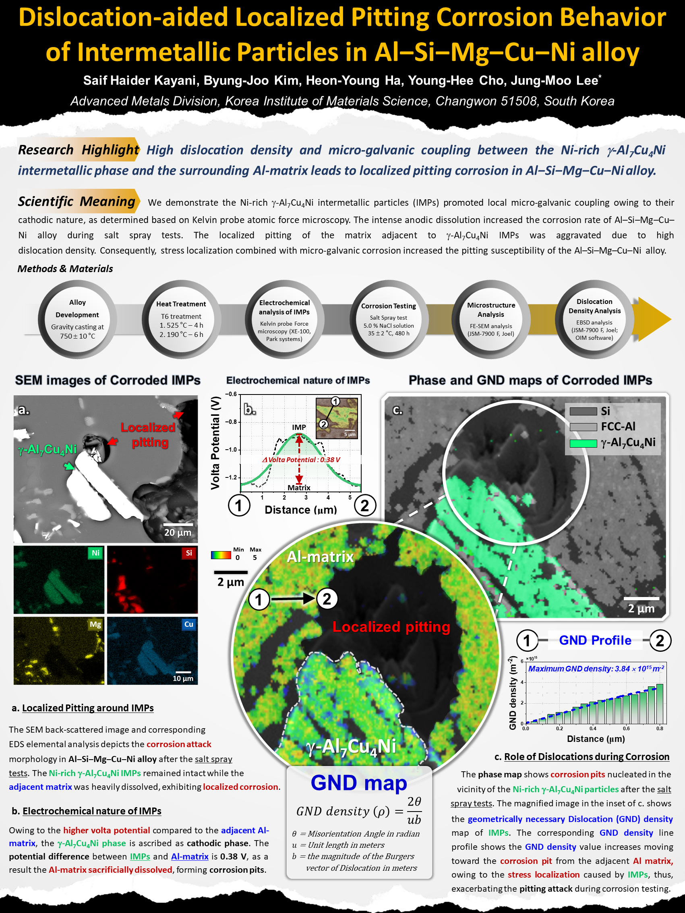
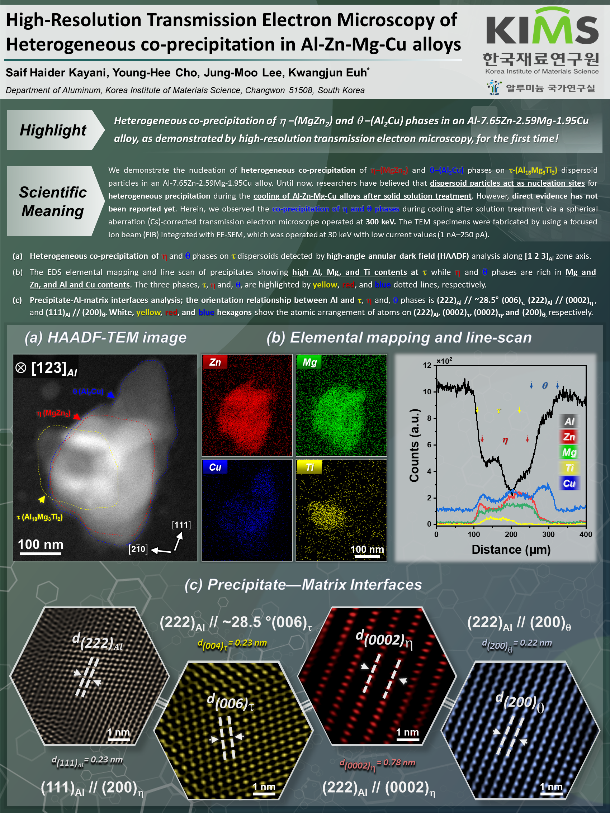
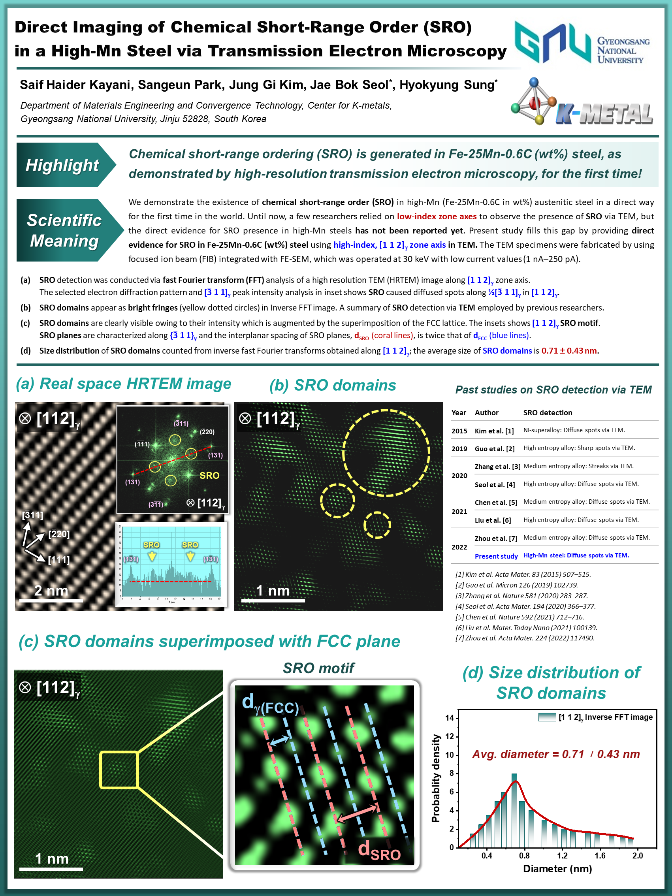

<h1> Materials Scientist </h1>

#### Technical Skills: Alloy Design, Microstructure, Deformation, Corrosion

<h2 style="margin-top:30px; margin-bottom:30px;">Research Highlights</h2>

  Click a research highlight to learn more.

  <a href="/research/sustainable-alloys-development.html" style="text-align:center; text-decoration:none; color:inherit;">
    
    
Sustainable Alloys Development

  </a>

  <a href="/research/high_strength_Al.html" style="text-align:center; text-decoration:none; color:inherit;">
    
    
High-Strength Aluminum Alloys

  </a>

  <a href="/research/ev-lightweighting.html" style="text-align:center; text-decoration:none; color:inherit;">
    
    
Lightweight Materials for Electric Vehicles

  </a>

  <a href="/research/extreme-environments.html" style="text-align:center; text-decoration:none; color:inherit;">
    
    
Materials for Extreme Environments

  </a>

  <a href="/research/microstructure-engineering.html" style="text-align:center; text-decoration:none; color:inherit;">
    
    
Microstructure Engineering & Refinement

  </a>

  <a href="/research/deformation-mechanisms.html" style="text-align:center; text-decoration:none; color:inherit;">
    
    
Microscopic Deformation Mechanisms

  </a>

  <a href="/research/ai-alloy-design.html" style="text-align:center; text-decoration:none; color:inherit;">
    
    
AI-Driven Alloy Design

  </a>

  <a href="/research/electron-microscopy.html" style="text-align:center; text-decoration:none; color:inherit;">
    
    
Advanced Electron Microscopy

  </a>

<h2>Education</h2>

- 
Ph.D., Advanced Materials Engineering <i>(Aug 2020)</i>  
  University of Science and Technology, South Korea  					       		
- 
M.S., Materials Engineering & Nanotechnology <i>(June 2015)</i>  
  GIK Institute of Engineering Sciences and Technology, Pakistan			        		
- 
B.S., Metallurgy and Materials Engineering <i>(Sep 2012)</i>  
  Baha-Ud-Din Zakriya University, Pakistan

<h2> Work Experience </h2>

<h3> Post-doctoral Fellow @ Nanjing university of Science and Technology <i>(Sep 2025 - Present)</i> </h3>
- 
 Developing and managing funding proposals for individual research projects, coordinating cross-functional research initiatives, and overseeing research projects to ensure adherence to timelines and quality standards. 

- 
 Advanced characterization techniques training to develop innovative solutions through fundamental scientific principles. 

- 
 Publish research findings in reputable journals, present at conferences, and mentor graduate students and interns in research, publications, and thesis writing. 

<h3> Senior Researcher @ Korea Institute of Materials Science <i>(Aug 2022 - Aug 2025)</i> </h3>
- 
 Developing and managing funding proposals for domestic research projects, coordinating cross-functional research initiatives to align with university and industry goals, and overseeing research projects to ensure adherence to timelines and quality standards. 

- 
 Design and conduct experiments using advanced characterization techniques to address technical challenges, identify root causes, and develop innovative solutions through fundamental scientific principles. 

- 
 Published research findings in reputable journals, presented at conferences, and collaborated with researchers and industry partners on shared objectives, and mentored undergraduate and graduate students and interns in research, publications, and thesis writing. 

<h3> Senior Researcher @ Gyeongsang National University <i>(Aug 2020 - July 2022)</i> </h3>
- 
 Developing and managing funding proposals for domestic and international research projects, coordinating cross-functional research initiatives to align with institutional and industry goals, and overseeing research projects to ensure adherence to timelines and quality standards. 

- 
 Design and conduct experiments using advanced characterization techniques to address technical challenges, identify root causes, and develop innovative solutions through fundamental scientific principles. 

- 
 Published research findings in reputable journals, presented at conferences, collaborated with researchers and industry partners on shared objectives, and mentored graduate students and interns in research, publications, and thesis writing. 

<h3> Student Researcher @ Korea Institute of Materials Science <i>(Sep 2015 - Aug 2020)</i> </h3>
- 
 Developing and coordinating cross-functional research initiatives to align with institutional and industry goals, and overseeing research projects to ensure adherence to timelines and quality standards. 

- 
 Design and conduct experiments using advanced characterization techniques to address technical challenges, identify root causes, and develop innovative solutions through fundamental scientific principles. 

- 
 Published research findings in reputable journals, presented at conferences, collaborated with researchers and industry partners on shared objectives. 

<h3> Graduate Assistant @ GIK Institute of Engineering Sciences and Technology, Pakistan <i>(Jan 2013 - Dec 2015)</i> </h3>
- 
 Deliver lectures, mentor undergraduate students in lab techniques and experiments, and prepare course-related records and lab manuals. 

- 
 Support faculty in experimental research, data collection, and analysis; assist in lecture preparation, grading, and conducting laboratory courses. 

- 
 Manage laboratory operations, including setup, organization, and maintenance of equipment, ensuring safety compliance, organizing departmental events. 

<h2> Projects </h2>

<h3 align="justify"> Development of low-carbon aluminum alloy with simultaneous implementation of multiple characteristics and greenhouse gas reduction of over 40% based on high-efficiency electric arc melting. <i>(2024 - 2027)</i> </h3>
- Funding: $0.2M
- Ministry of Trade, Industry and Energy, South Korea
- Principle Investigator: Young-Hee Cho  

<h3 align="justify"> Development of 200℃/250MPa grade composite aluminum casting alloy and brake disc/friction material manufacturing technology. <i>(2022 - 2026)</i> </h3>
- Funding: $0.2M
- Defense Acquisition Program Administration, South Korea
- Principle Investigator: Jung-Moo Lee          

<h3 align="justify"> Development of eco-friendly aluminum material technology to ease impurity regulations. <i>(2021 - 2026)</i> </h3>
- Funding: $0.9M
- Ministry of Science and ICT, South Korea
- Principle Investigator: Young-Hee Cho         

<h3 align="justify"> An innovative light metal technology for shielding a large and high voltage xEV generator. <i>(2022 - 2024)</i> </h3>
- Funding: $1.5M
- Defense Acquisition Program Administration, South Korea
- Principle Investigator: Kwangjun Euh         

<h2> Patents </h2>

 1. High-elasticity aluminum alloy casting material. <i>(KOR)</i>  
Jung-Moo Lee, Young-Hee Cho, <b>Saif Haider Kayani</b>, Lee Yoon-Ho, Kim Dong-Woo, Lee Sang-ik.  
Registered. (2024)                                                                 

 2. Manufacturing method of micro-pillar aluminum alloy specimens for physical properties evaluation and micro-pillar aluminum alloy specimens for physical properties. <i>(KOR)</i> 
Hyokyung Sung, Jae Bok Seol, Jung Gi Kim, Sangeun Park, <b>Saif Haider Kayani</b>, Je Hyun Lee. 
Application No. 1020230034478. (2023)                                               

 3. The manufacturing method for Inconel 718 alloy multilayer-shaped structure with excellent low-temperature tensile properties and Inconel 718 alloy multilayer-shaped structure. <i>(KOR)</i> 
Hyokyung Sung, Sangeun Park, Ha Eum Park, <b>Saif Haider Kayani</b>, Je Hyun Lee. 
Application No. 1020230034479. (2023)                                                

<h2>Publications</h2>

<h3>Corresponding Author</h3>

 1. Impact of Intermetallic phase on pitting corrosion and high-temperature tensile properties of Al-Si-Cu-Ni alloys.  
<b>Saif Haider Kayani</b>, Heon-Young Ha, Byung-Joo Kim, Young-Hee Cho, Hyeon-Woo Son, Jung-Moo Lee  
<i>Corrosion Science (2024) 112064</i>.  <a href="https://doi.org/10.1016/j.corsci.2024.112064"> DOI</a> 

 2. Microstructural refinement in a high Elastic Modulus Al-18Si-8Ni casting alloy.  
Yoon-Ho Lee, <b>Saif Haider Kayani</b>, Jung-Moo Lee, Sang-Ik Lee, Se-Jong Kim, Jae-Il Jang, Young-Hee Cho  
<i>Journal of Alloys and Compounds 1008 (2024) 176580</i>.  <a href="https://doi.org/10.1016/j.jallcom.2024.176580"> DOI</a> 

 3. Influence of Powder Size on Pore characteristics and Intermetallic Phase Kinetics in porous Ti-Al alloy.  
<b>Saif Haider Kayani</b>, Hafiz Muhammad Salman Ajmal, Byung-Joo Kim, Nho-Kwang Park, Kwangjun Euh  
<i>Crystals 14(4) (2024) 559</i>.  <a href="https://doi.org/10.3390/cryst14060559"> DOI</a>

 4. Dislocation-assisted localized pitting corrosion behavior of Al‒Si‒Mg‒Cu‒Mn alloy.  
<b>Saif Haider Kayani</b>, Heon-Young Ha, Young-Hee Cho, Hyeon-Woo Son, Jung-Moo Lee  
<i>Corrosion Science 221 (2023) 111372</i>.  <a href="https://doi.org/10.1016/j.corsci.2023.111372"> DOI</a> 

<h3>First Author</h3>  

 5. Strength-elongation synergy via controlled precipitation hardening in counter pressure cast Al-7Si-0.35Mg casting alloy with T5 treatment.  
<b>Saif Haider Kayani†</b>, Tae-Min Koo†, Soo-Bae Kim, Jung-Moo Lee, Kwangjun Euh, Young-Hee Cho  
<i>Materials Science and Engineering A 939 (2025) 148503</i>.  <a href="https://doi.org/10.1016/j.msea.2025.148503"> DOI</a> 

 6. The Effect of melt treatment on the precipitation behavior and mechanical properties of Direct-chilled cast Al-Si-Mg alloy.  
Sang-Ik Lee†, <b>Saif Haider Kayani†</b>, Yoon-Ho Lee, Byung-Joo Kim, Jung-Moo Lee, Je-In Lee, Kwangjun Euh, Young-Hee Cho  
<i>Journal of Materials Research and Technology 33 (2024) 2704-2717</i>.  <a href="https://www.sciencedirect.com/science/article/pii/S2238785424021914"> DOI</a> 

 7. Effect of as-cast microstructure on precipitation behavior and thermal conductivity of T5-treated Al-7Si-0.35Mg alloy.  
<b>Saif Haider Kayani†</b>, Seung-Uk Lee†, Kwangjun Euh, Jung-Moo Lee, Young-Hee Cho  
<i>Journal of Alloys and Compounds 976 (2023) 173004</i>.  <a href="https://www.sciencedirect.com/science/article/pii/S0925838823043074"> DOI</a> 

 8. Pore formation mechanism and intermetallic phase transformation in Ti-Al alloy during reactive sintering.  
<b>Saif Haider Kayani</b>, Min Cui, Rana Tariq Mehmood Ahmed, Young-Hee Cho, Jung-Moo Lee, Nho-Kwang Park, Hafiz Muhammad Salman Ajmal, Kwangjun Euh  
<i>Journal of Materials Research and Technology 22 (2023) 1878-1887</i>.  <a href="https://www.sciencedirect.com/science/article/pii/S2238785422019469"> DOI</a>

 9. Experimental and crystal plasticity finite element study of the deformation behavior of high-Mn steel micropillars.  
Sangyul Ha†, <b>Saif Haider Kayani†</b>, Kyungjun Lee, Sangeun Park, Jung Gi Kim, Jae Bok Seol, Hyokyung Sung  
<i>Steel Research International 94 (2023) 2200254</i>.  <a href="https://onlinelibrary.wiley.com/doi/full/10.1002/srin.202200254"> DOI</a>

 10. Dislocation-aided electrochemical behavior of precipitates in stress corrosion cracking of Al–Zn–Mg–Cu alloys.  
<b>Saif Haider Kayani</b>, Sangeun Park, Kwangjun Euh, Jae Bok Seol, Jung Gi Kim, Hyokyung Sung  
<i>Materials characterization 190 (2022) 112019</i>.  <a href="https://www.sciencedirect.com/science/article/pii/S1044580322003011"> DOI</a>

 11. Direct observation of chemical short-range order in 25 wt% Mn steel via transmission electron microscopy.  
<b>Saif Haider Kayani</b>, Sangeun Park, Jung Gi Kim, Jae Bok Seol, Hyokyung Sung  
<i>Scripta Materialia 213 (2022) 114642</i>.  <a href="https://www.sciencedirect.com/science/article/pii/S1359646222001427"> DOI</a>

 12. High Strength Aluminum Alloys Design via Explainable Artificial Intelligence.  
Seobin Park†, <b>Saif Haider Kayani†</b>, Kwangjun Euh, Eunhyeok Seo, Hayeol Kim, Sangeun Park, Bishnu Nand Yadav, Seong Jin Park, Hyokyung Sung, Im Doo Jung  
<i>Journal of Alloys and Compounds 903 (2022) 163828</i>.  <a href="https://www.sciencedirect.com/science/article/pii/S0925838822002195"> DOI</a>

 13. Effect of Cooling Rate on Precipitation Behavior of Al–7.65Zn–2.59Mg–1.95Cu Alloy with Minor Elements of Zr and Ti.  
<b>Saif Haider Kayani</b>, Jae-Gil Jung, Min-Seok Kim, Kwangjun Euh  
<i>Metals and Materials International 26 (2020) 1079-1086</i>.  <a href="https://link.springer.com/article/10.1007/s12540-019-00385-1"> DOI</a>

 14. Effect of Cr and Nb on the phase transformation and pore formation of Ti-Al base alloys.  
<b>Saif Haider Kayani</b>, Nho-Kwang Park  
<i>Journal of Alloys and Compounds 708 (2017) 308-315</i>.  <a href="https://www.sciencedirect.com/science/article/pii/S0925838817307740"> DOI</a>

 15. Precipitation Behavior of Thermo-Mechanically Treated Ti50Ni20Au20Cu10 High-Temperature Shape-Memory Alloy.  
<b>Saif Haider Kayani</b>, M. Imran Khan, Fazal Ahmad Khalid, Hee Young Kim, Shuichi Miyazaki  
<i>Shape Memory and Superelasticity 2 (2016) 29-360</i>.  <a href="https://link.springer.com/article/10.1007/s40830-015-0048-6"> DOI</a>

<h3>Co-Author</h3> 

 16. Role of Ni in High elastic modulus Al-Si-Ni alloys: Solidification and Microstructure evolution.  
Yoon-Ho Lee, <b>Saif Haider Kayani</b>, Jung-Moo Lee, Sang-Ik Lee, Young-Hee Cho  
<i>Materials Characterization 115768</i>.  <a href="https://doi.org/10.1016/j.matchar.2025.115768"> DOI</a>

 17. Effect of Initial microstructure on dynamic recrystallization behavior during creep deformation of modified Nimonic 80A alloy.  
Shaik Muhammad Ali, Hyungsoo Lee, Dae Won You, <b>Saif Haider Kayani</b>, Young-Soo You, Seo-Moon Seo, HiWon Jeong  
<i>Materials Science and Engineering A 149323</i>.  <a href="https://doi.org/10.1016/j.msea.2025.149323"> DOI</a>

 18. Data-driven design of Al–Fe alloys for laser powder bed fusion to enhance recycled aluminum utilization.  
Abdul Wahid Shah, Jabir Ali Siddique, Umar Daraz, <b>Saif Haider Kayani</b>, Javed Hussain, Ghulam Mudassir, Kang Wang, Wenfeng Li  
<i>Journal of Alloys and Compounds 1039 (2025) 183278</i>.  <a href="https://doi.org/10.1016/j.jallcom.2025.183278"> DOI</a>

 19. Effect of retrogression treatment on microstructure, mechanical properties, and corrosion behavior in Al-Zn-Mg-Cu alloy.  
Hyojin Hwang, Chang-Gi Lee, <b>Saif Haider Kayani</b>, Hyoung-Wook Kim, Je In Lee, Se-Ho Kim, Yong-Hee Jo  
<i>Journal of Materials Research and Technology 36 (2025) 10577-10590</i>.  <a href="https://doi.org/10.1016/j.jmrt.2025.05.236"> DOI</a>

 20. Solidification behavior and mechanical properties of a quaternary eutectic Al-Cu-Si-Mg alloy.  
Byung-Joo Kim, <b>Saif Haider Kayani</b>, Zhirou Zhang, Young-Hee Cho, Su-Hyeon Kim  
<i>Journal of Alloys and Compounds 1007 (2024) 176351</i>.  <a href="https://www.sciencedirect.com/science/article/pii/S0925838824029384"> DOI</a>

 21. Formation and Evolution of Interfacial structure in Al-Si-Mg/Stainless steel Bimetals during hot-dipping process.  
Byung-Joo Kim, Ha-Yoon Lim, <b>Saif Haider Kayani</b>, Yun-Soo Lee, Su-Hyeon Kim, Joon-Hyeon Cha  
<i>Crystals 14(4) (2024) 387</i>.  <a href="https://www.mdpi.com/2073-4352/14/4/387"> DOI</a>

 22. Microscopic-plastic deformation behavior of grain boundary precipitates in an Al-Zn-Mg alloy.  
Sangyul Ha, <b>Saif Haider Kayani</b>, Kyungjun Lee, Suwon Park, Hyunjoo Choi, Jae Bok Seol, Jung Gi Kim, Hyokyung Sung  
<i>Journal of Materials Research and Technology 30 (2024) 3420-3429</i>.  <a href="https://www.sciencedirect.com/science/article/pii/S2238785424008172"> DOI</a>

 23. The influence of chemical short-range order on the nanoindentation properties of high-entropy alloys prepared via laser powder bed fusion.  
Shuai Guo, Meng Wang, Qian Wang, Shang Sui, <b>Saif Haider Kayani</b>, Jae Bok Seol, Pengcheng Zhu, Anfu Guo, Xin Lin, Weidong Huan  
<i>Materials Characterization 207 (2024) 113560</i>.  <a href="https://www.sciencedirect.com/science/article/pii/S1044580323009191"> DOI</a>     

 24. Melt thermal-rate treatment for uniform solute distribution and improved mechanical properties of an Al-Zn-Mg-Cu alloy prepared by direct-chill casting.  
Byung-Joo Kim, Su-Hyeon Kim, <b>Saif Haider Kayani</b>, Yoon-Ho Lee, Won-Kyoung Kim, Hyun-Seok Cheon, Jisu Kim, Young-Hee Cho  
<i>Journal of Alloys and Compounds 967 (2023) 171745</i>.  <a href="https://www.sciencedirect.com/science/article/pii/S1044580323009191"> DOI</a>  

 25. The role of prestraining on mechanical properties and microstructure of preaged AA 6016 Al-Mg-Si sheets-chill casting.  
MinCui, <b>Saif Haider Kayani</b>, Hyoung-Wook Kim, Je-Hyun Lee  
<i>Journal of Alloys and Compounds 960 (2023) 170681</i>.  <a href="https://www.sciencedirect.com/science/article/pii/S0925838823019849"> DOI</a>  

 26. Microstructural Effects on J-Integral Fracture Toughness of Welded High-Mn Steels at 298 and 77 K.  
Sangeun Park, <b>Saif Haider Kayani</b>, Eun Hye Park, Jung Gi Kim, Sangshik Kim, Hyokyung Sung, Jae Bok Seol  
<i>Steel Research International 94 (2023) 2200259</i>.  <a href="https://onlinelibrary.wiley.com/doi/full/10.1002/srin.202200259"> DOI</a> 

 27. Effects of Cu additions on the precipitation activation energy and mechanical properties of prestrained Al–Mg–Si alloys.  
MinCui, Yong Hee Jo, <b>Saif Haider Kayani</b>, Hyoung-Wook Kim, Je-Hyun Lee  
<i>Journal of Materials Research and Technology 20 (2022) 2629-2637</i>.  <a href="https://www.sciencedirect.com/science/article/pii/S223878542201270"> DOI</a> 

 28. Effect of Interdendritic Precipitations on the Mechanical Properties of GBF or EMS Processed Al-Zn-Mg-Cu Alloys.  
Sangeun Park, <b>Saif Haider Kayani</b>, Hyungrae Kim, Im Doo Jung, N.S. Reddy, Kwangjun Euh, Jae Bok Seol, Jung Gi Kim, Hyokyung Sung  
<i>Crystals 11(10) (2021) 1162</i>.  <a href="https://www.mdpi.com/2073-4352/11/10/1162"> DOI</a> 

 29. Crystallographic characterization of Al18Mg3Ti2 intermetallic phase in Al–Zn–Mg–Cu–Zr–Ti alloy.  
Sang-Hwa Lee, <b>Saif Haider Kayani</b>, Jae-Gil Jung, Sung-Il Baek, Min-Seok Kim, Young-Kook Lee, Kwangjun Euh  
<i>Journal of Alloys and Compounds 844 (2020) 156173</i>.  <a href="https://www.sciencedirect.com/science/article/pii/S0925838820325378"> DOI</a> 

 30. Mechanical properties and microstructure of rolled and electrodeposited thin copper foil.  
Xiang-Qian Yin, Li-Jun Peng, <b>Saif Kayani</b>, Lei Cheng, Jian-Wei Wang, Wei Xiao, Li-Gen Wang, Guo-Jie Huang  
<i>Rare Metals 35 (2016) 909-914</i>.  <a href="https://link.springer.com/article/10.1007/s12598-016-0806-4"> DOI</a>

 31. n-InAs based photo-thermo-electrochemical cells for conversion of solar to electrical energy.  
Zubair Ahmad, Khasan S. Karimov, Farid Touatia, M. Salman Ajmal, Taimoor Ali, <b>Saif Haider Kayani</b>, K. Kabutov, R. A. Shakoord, N. J. Al-Thanid  
<i>Journal of Electroanalytical Chemistry 775 (2016) 267-272</i>.  <a href="https://www.sciencedirect.com/science/article/pii/S1572665716303009"> DOI</a>

<h3>Editorials</h3> 

 32. Microstructure and Mechanical behavior of Structural Materials: 2nd Edition.  
<b>Saif Haider Kayani</b>, Byung-Joo Kim  
<i>Crystals 15(11) (2025) 997</i>.  <a href="https://doi.org/10.3390/cryst15110997"> DOI</a>

 33. Microstructure and Mechanical behavior of Structural Materials.  
<b>Saif Haider Kayani</b>, Byung-Joo Kim  
<i>Crystals 14(12) (2024) 1076</i>.  <a href="https://www.mdpi.com/2073-4352/14/12/1076"> DOI</a> 

<h3>Conference proceedings</h3>

 34. Influence of Thermal-Rate Treatment on Precipitation Evolution and Mechanical Properties of Thermal-Rate Treated Al–10Si–0.35Mg Alloy. 
Sang-Ik Lee, <b>Saif Haider Kayani</b>, Yoon-Ho Lee, Kwangjun Euh, Je-In Lee, Young-Hee Cho 
<i>Light Metals 2025. TMS 2025. The Minerals, Metals & Materials Series. Springer, Cham</i>.  <a href="https://doi.org/10.1007/978-3-031-80676-6_41"> DOI</a>

<h3>Under submission</h3>

 34. Atomic structure of β″ precipitates in high-Si containing Al-Si-Mg alloy.  
<b>Saif Haider Kayani</b>, Sang-Ik Lee, Yoon-Ho Lee, Jung-Moo Lee, Kwangjun Euh, Young-Hee Cho <i>(under review)</i>  

 35. Vacancy-dragged Zr segregation at U1/Al interfaces in Al-Si-Mg cast alloy.  
<b>Saif Haider Kayani</b>, Dongwon Shin, Sang-Ik Lee, Yoon-Ho Lee, Kwangjun Euh, Young-Hee Cho <i>(under submission)</i>  

 36. Effect of G phase on thermal hardenability of Duplex stainless steels.  
Boxia Zhang, <b>Saif Haider Kayani</b>, Shilei Li, Jian Yin, Gang Sha <i>(under submission)</i>  

<h2>Conference Talks</h2> 

<h3>International</h3>

 1. Vacancy-dragged Zr segregation at U1/Al interfaces in Al-Si-Mg cast alloy.  
<b>Saif Haider Kayani</b>, Jung-Moo Lee, Kwangjun Euh, Dongwon Shin, Young-Hee Cho, Gang Sha  
<i>The 23rd Conference on International Exchange of Professionals, 2025</i>.  

 2. Sustainable Development of Aluminum alloys via Melt Thermal treatment.  
<b>Saif Haider Kayani</b>, Sang-Ik Lee, Yoon-Ho Lee, Kwangjun Euh, Young-Hee Cho  
<i>The 8th International Conference on Electronic Materials and Nanotechnology for Green Environment, 2024</i>.  

 3. Dislocation-assisted Localized Corrosion Behavior of Intermetallic particles in Al alloys.  
<b>Saif Haider Kayani</b>, Young-Hee Cho, Heon-Young Ha, Jung-Moo Lee  
<i>The 8th International Conference on Electronic Materials and Nanotechnology for Green Environment, 2024</i>.  

 4. Effect of As-cast microstructure on Precipitation behavior and Thermal conductivity of Al-Si-Mg alloys.  
<b>Saif Haider Kayani</b>, Kwangjun Euh, Jung-Moo Lee, Young-Hee Cho  
<i>The 75th World Foundry Congress (WFC), 2024</i>. 

 5. Nano-scale co-precipitation Mechanism in Al‒Si‒Mg Alloys.  
<b>Saif Haider Kayani</b>, Sang-Ik Lee, Yoon-Hee Lee, Jung-Moo Lee, Kwangjun Euh, Young-Hee Cho  
<i>The 22nd International Nanotech Symposium, 2024</i>. 

 6. Exploring Corrosion Behavior of Al‒Si‒Mg Alloys: Role of Intermetallic Phases.  
<b>Saif Haider Kayani</b>, Young-Hee Cho, Hyeon-Young Ha, Jung-Moo Lee  
<i>The 22nd International Nanotech Symposium, 2024</i>. 

 7. The Interplay of Precipitation Hardening and Conductivity in Al-Si-Mg Alloys.  
<b>Saif Haider Kayani</b>, Kwangjun Euh, Jung-Moo Lee, Young-Hee Cho  
<i>Global Conference on Innovation Materials (GCIM), 2024</i>. 

 8. Exploring Corrosion Behavior of Al‒Si‒Mg Alloys: Role of Intermetallic Phases.  
<b>Saif Haider Kayani</b>, Young-Hee Cho, Hyeon-Young Ha, Jung-Moo Lee  
<i>Global Conference on Innovation Materials (GCIM), 2024</i>. 

 9. Effect of initial microstructure on age-hardenability and thermal conductivity of Al-7Si-0.35Mg alloy.  
<b>Saif Haider Kayani</b>, Kwangjun Euh, Jung-Moo Lee, Young-Hee Cho  
<i>The 11th Pacific Rim International Conference on Advanced Materials and Processing (PRICM11), 2023</i>. 

 10. Dislocation-aided Localized Pitting Corrosion of Intermetallic Particles in Al‒Si‒Mg‒Cu‒Mn Alloy.  
<b>Saif Haider Kayani</b>, Young-Hee Cho, Ju-Hyun Sun, Lee-Cheol Ji, Jung-Moo Lee  
<i>The 20th International Microscopy Congress (IMC20), 2023</i>. 

 11. Impact of Solidification-Induced Pre-Precipitation on the Age-Hardenability and Thermal Conductivity of Al‒7Si‒0.35Mg Alloy.  
<b>Saif Haider Kayani</b>, Kwangjun Euh, Jung-Moo Lee, Young-Hee Cho  
<i>The 20th International Microscopy Congress (IMC20), 2023</i>. 

 12. Effect of solution treatment on microstructure and mechanical behavior of precipitation-hardened Al-Zn-Mg-Cu alloy.  
<b>Saif Haider Kayani</b>, Jae Bok Seol, Jung Gi Kim, Kwangjun Euh, Hyokyung Sung  
<i>30th International Symposium on Technology of Plasticity, 2021</i>. 

<h3>Domestic</h3>

 13. (2018-2025) Presented at Spring and Fall Meetings of the <b> Korea Institute of Metals and Materials</b>, South Korea.  

 14. (2021-2022) Presented at <b>Advanced Structural Materials Symposium</b>, South Korea.  

 15. (2023-2024) Presented at Spring and Fall Meetings of the <b>Korean Foundry Society</b>, South Korea.  

<h2>Achievements</h2>

<h3>Career Awards</h3>

 2025 Academic Award, <i>Korea Institute of Materials Science</i>.  
 
<h3>Talks Awards</h3>

 2024 Outstanding Oral Presentation, <i>The Korean Foundry Society</i>.  

 2020 Outstanding Oral Presentation (Structural Materials), <i>Materials Research Society-Korea</i>.  
 
<h3>Scientific Awards</h3>

 2024 Outstanding Contribution in Materials Photography, <i>The Korean Institute of Metals and Materials</i>. 

 <b>Awarded work</b> 
              

 2023 Outstanding Contribution in Materials Photography, <i>The Korean Institute of Metals and Materials</i>. 

 <b>Awarded work</b> 
              

 2022 Outstanding Contribution in Materials Photography, <i>The Korean Institute of Metals and Materials</i>. 

 <b>Awarded work</b> 
              

<h3>Editorial Positions</h3>

Crystals (MDPI) <i></i>(2022 - 2026) 
Guest Editor—Microstructure and Mechanical Behaviour of Structural Materials (Special issues) 
  <a href="https://www.mdpi.com/journal/crystals/special_issues/64ZFT5G999"> 1st Edition</a>
  <a href="https://www.mdpi.com/journal/crystals/special_issues/S5C0663330"> 2nd Edition</a> 
  <a href="https://www.mdpi.com/journal/crystals/special_issues/893EISHRKS"> 3rd Edition</a>

<b>Edited Book (reprint):</b> Microstructure and Mechanical Behaviour of Structural Materials, MDPI, <i>2025</i>. 

ISBN:978-3-7258-6027-2 (Hardbook)<a href="https://www.mdpi.com/books/reprint/12060-microstructure-and-mechanical-behaviour-of-structural-materials"> DOI</a> 

<h3>Peer Review Positions</h3>

 <b>Springer Nature:</b> Progress in Additive Manufacturing, Scientific Reports.  

 <b>Elsevier:</b> Materials Science and Engineering A, Journal of Materials Research and Technology, Journal of Alloys and Compounds, Intermetallics, Materials Letters, Theoretical and Applied Fracture Mechanics, Transactions of Nonferrous Metals Society of China, Materials Today Communications. Micron.  

 <b>Wiley:</b> Advanced Engineering Materials.  

 <b>Springer:</b> Rare Metals, Metals and Materials International.  

 <b>Taylor & Francis:</b> Materials Research Letters, Surface Engineering, Advances in Materials and Processing Technologies.  

<h3>Techincal Expertise</h3>

- Transmission Electron Microscopy <i>(Certified user FEI, TF30ST at GNU, South Korea)</i> 

- Scanning Electron Microscopy <i>(Certified user Jeol, JSM 6610 at KIMS, South Korea)</i> 

- Electron Backscatter Diffraction Analysis <i>(Certified user Jeol JSM 7900F at CWNU and GNU, South Korea)</i> 

- Electron channeling contrast imaging <i>(Certified user Thermo Fisher, Apreo S at GNU, South Korea)</i> 

- Focused Ion Beam – Micro-Pillar Fabrication <i>(Certified user TESCAN, MIRA at GNU, South Korea)</i> 

- TEM sample Preparation <i>(Certified user PIPS, Twin Jet Electro and Dimple Polishing, at KIMS, South Korea)</i>  

- Nanoindentation <i>(Certified user Anton Paar, NHT3, at GNU, South Korea)</i> 

- X-ray Diffractometer <i>(Certified user Rigaku, D-max 2500, at KIMS, South Korea)</i> 

- Corrosion Analyses – Potentiodynamic Polarization <i>(Expert user; during Ph. D and Professional career)</i> 

- Metallography, Electro-polishing, and Optical Microscopy <i>(Expert user; during Ph. D and Professional career)</i> 

- Electric Arc Melting and Vacuum Furnaces <i>(Occasional operator; during Ph. D and MS work)</i> 

<h3>Software Expertise</h3>

- GATAN Digital Microscopy <i>(Expert user; Lattice, Precipitation, Diffraction pattern, and FFT analyses)</i> 

- Factsage, Thermo-Calc <i>(Expert user; Solidification and Phase Diagram analyses)</i> 

- Geometrical Phase analysis <i>(Expert user; Lattice Strain Analysis)</i>  

- Single Crystal, Crystal Diffract, Carine, Vesta structure, TWIST <i>(Expert user; Crystal structure analysis)</i> 

- MDI Jade <i>(Expert user; XRD peak and phase identification analyses)</i>  

- Aztec, INCA, TSL-OIM <i>(Expert user; EDS and EBSD analyses)</i> 

- XEI <i>(Expert user; SKFM and AFM analyses)</i> 

- ImageJ, iSolutionDT <i>(Expert user; Image analysis)</i> 

- Origin Pro <i>(Expert user; Graphing, Data Analysis, Curve Fitting, and Mathematical Function, etc.)</i> 

<h3 style="margin-top:30px; margin-bottom:30px; text-align:center; color:#B0B0B0;">Copyright Notice</h3>

  © 2026 Saif Haider Kayani. All rights reserved.

  All content, images, research materials, and other intellectual property on this repository are protected by copyright. Reuse or reproduction is allowed only with explicit permission or under the terms specified in the license below.

  For inquiries, please contact: <a href="mailto:saifkayani@gnu.ac.kr" style="color:#B0B0B0;">saifkayani@gnu.ac.kr</a>.

